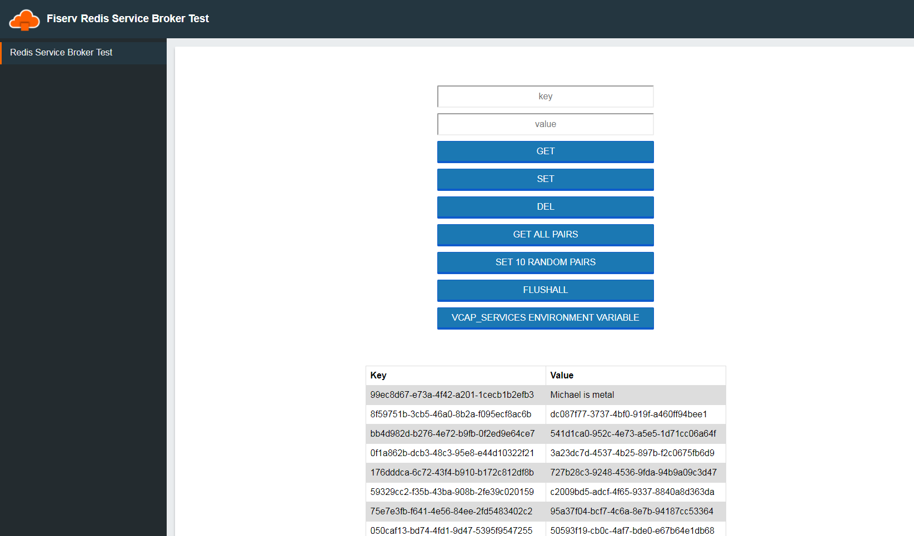

#Redis Service Broker Test
Cloud native applicaiton intended be used to testesting RLEC or FOSS redis service brokers. 
App needs to bind to a service instance, then can read interact with redis database.
Build using valueOperations. Intended to store String:String pairs.
- Feature to get a pair.
- Feature to set a pair.
- Feature to delete a pair.
- Feature to get all pairs.
- Feature to set random guid pairs.
- Feature to delete all pairs.
- Feature to print VCAP_SERVICES environment variable.
- Password field from VCAP_SERVICES redacted.

